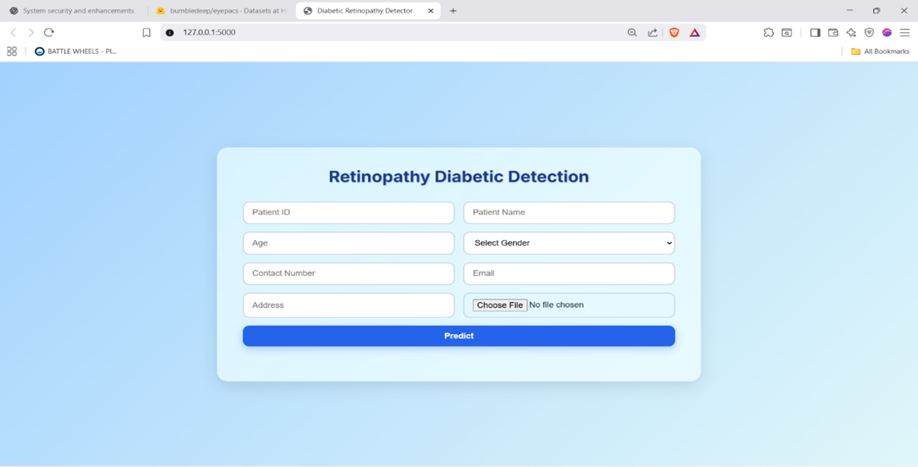
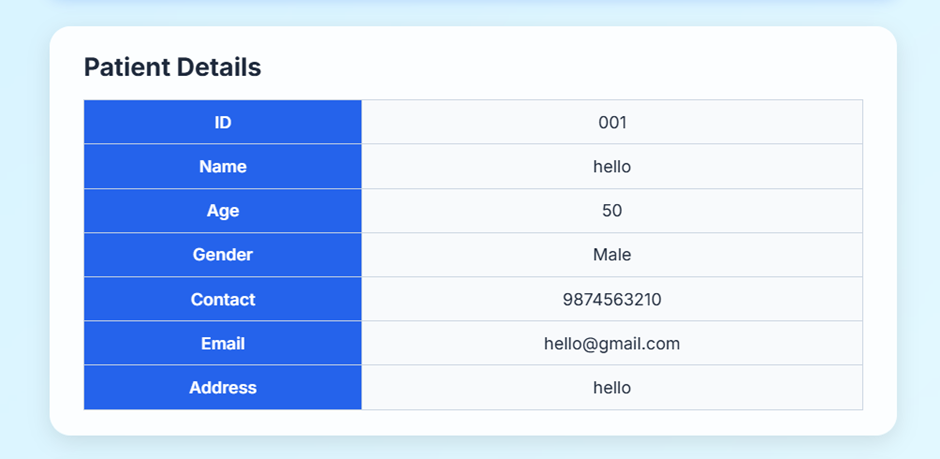
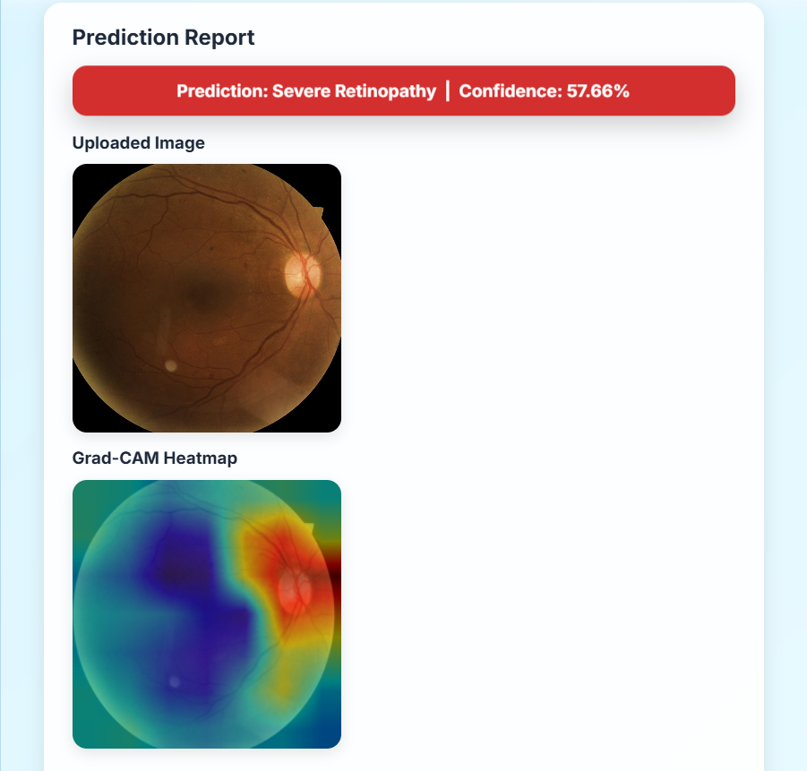
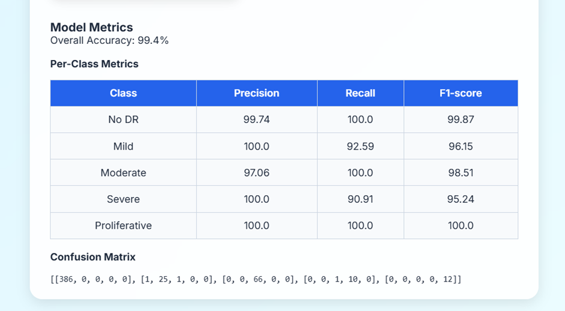

# 🩺 Diabetic Retinopathy Detection using Deep Learning


This project implements a **deep learning system for detecting Diabetic Retinopathy (DR)** from retinal fundus images using a **CNN with attention mechanism**. It provides a complete pipeline from model training to deployment with a web interface for clinical use.

## 🌐 Web Application Preview
**Home Page**


**Patient Details**


**Predection Result**


**Sample Confusion Matrix Metrics**


**Generate Report**


## ✨ Features

- **🖼️ Image Classification**: Classifies retinal images into 5 DR severity levels
- **🧠 Attention Mechanism**: Enhanced CNN with attention for better feature extraction
- **🔥 Grad-CAM Visualization**: Explainable AI with visual heatmaps showing model focus areas
- **🌐 Web Interface**: User-friendly Flask application for easy upload and prediction
- **📊 Comprehensive Evaluation**: Detailed metrics and confusion matrix analysis
- **📄 Report Generation**: Automated PDF reports with patient details and predictions
- **⚡ Modular Design**: Separate modules for training, evaluation, and inference

## 📁 Project Structure

```
.
├── app.py                          # Main Flask web application
├── train.py                        # Model training script
├── inference.py                    # Prediction on single images
├── evaluate.py                     # Model evaluation script
├── gradcam.py                      # Grad-CAM visualization
├── requirements.txt                # Python dependencies
├── dataset_eyepacs/                # Dataset handling utilities
│   └── dataset_eyepacs.py          # Dataset loader and preprocessing
├── models/                         # Model architectures
│   └── cnn_attention.py            # CNN with attention mechanism
├── models_weights/                 # Saved model weights
│   ├── dr_model.pth                # Trained model weights
│   └── metrics.json                # Evaluation metrics
├── static/                         # Web assets
│   ├── uploads/                    # User-uploaded images
│   ├── heatmaps/                   # Generated Grad-CAM heatmaps
│   └── reports/                    # Generated PDF reports
├── templates/                      # HTML templates
│   ├── index.html                  # Main web interface
│   └── report.html                 # Report template
└── README.md                       # This file
```

## 📊 Dataset

**EyePACS Dataset** (Diabetic Retinopathy Detection)

Download from: [https://huggingface.co/datasets/bumbledeep/eyepacs](https://huggingface.co/datasets/bumbledeep/eyepacs)

### Dataset Details
- **Classes**: 5 DR severity levels (0-4)
- **Labels**: 
  - **0**: No Diabetic Retinopathy
  - **1**: Mild DR
  - **2**: Moderate DR
  - **3**: Severe DR
  - **4**: Proliferative DR
- **Format**: Retinal fundus images in JPEG format
- **Size**: ~35,000 training images, ~53,000 test images (varies by subset)

**Note**: The dataset exhibits significant class imbalance. Consider data augmentation or weighted loss functions during training.

## 🚀 Quick Start

### 1. Installation

Clone the repository and install dependencies:

```bash
git clone https://github.com/SaranKavin/diabetic-retinopathy-detector.git
cd diabetic-retinopathy-detector

# Create virtual environment (optional but recommended)
python -m venv venv
source venv/bin/activate  # On Windows: venv\Scripts\activate

# Install dependencies
pip install -r requirements.txt
```

### 2. Download Dataset

#### Option A: Using Hugging Face Datasets (Recommended)
```python
from datasets import load_dataset

# Load dataset
dataset = load_dataset("bumbledeep/eyepacs")

# Or download to specific directory
dataset = load_dataset("bumbledeep/eyepacs", data_dir="./dataset_eyepacs/")
```

#### Option B: Manual Download
1. Visit [Hugging Face Dataset Page](https://huggingface.co/datasets/bumbledeep/eyepacs)
2. Download the dataset files
3. Extract to `dataset_eyepacs/` directory with structure:
   ```
   dataset_eyepacs/
   ├── train/
   │   ├── images/
   │   └── labels.csv
   └── test/
       ├── images/
       └── labels.csv
   ```

### 3. Run Web Application

Start the Flask development server:

```bash
python app.py
```

Open your browser and navigate to: [http://127.0.0.1:5000](http://127.0.0.1:5000)

## ⚙️ Detailed Usage

### 🚀 Training the Model

Train the CNN with attention mechanism:

```bash
python train.py \
    --data_dir ./dataset_eyepacs/ \
    --epochs 50 \
    --batch_size 32 \
    --learning_rate 0.001 \
    --output_dir ./models_weights/
```

**Training Parameters**:
- `--data_dir`: Path to EyePACS dataset
- `--epochs`: Number of training epochs (default: 50)
- `--batch_size`: Batch size (default: 32)
- `--learning_rate`: Learning rate (default: 0.001)
- `--model_name`: Output model name (default: dr_model.pth)

### 🧪 Evaluate the Model

Evaluate model performance on test data:

```bash
python evaluate.py \
    --model_path ./models_weights/dr_model.pth \
    --test_dir ./dataset_eyepacs/test/ \
    --output_csv evaluation_results.csv
```

**Outputs**:
- `evaluation_results.csv`: Detailed per-image predictions
- `metrics.json`: Overall model metrics (accuracy, precision, recall, F1-score)
- Confusion matrix visualization

### 🔍 Inference (Single Image Prediction)

Run prediction on a single retinal image:

```bash
python inference.py \
    --image path/to/retinal_image.jpg \
    --model_path ./models_weights/dr_model.pth
```

### 🔥 Grad-CAM Visualization

Generate Grad-CAM heatmaps to visualize model attention:

```bash
python gradcam.py \
    --image path/to/retinal_image.jpg \
    --model_path ./models_weights/dr_model.pth \
    --output_dir ./static/heatmaps/
```

**Output**: Heatmap image saved in `static/heatmaps/` showing regions influencing prediction

### 🌐 Web Application Usage

1. **Upload Image**: Navigate to the web interface and upload a retinal fundus image
2. **Enter Patient Details**: Fill in patient information (ID, name, age, etc.)
3. **Get Prediction**: System will display:
   - DR severity prediction (0-4)
   - Confidence score
   - Grad-CAM heatmap
   - Option to download PDF report

4. **Generate Report**: Click "Generate Report" to create a detailed PDF including:
   - Patient information
   - Prediction results
   - Model metrics
   - Retinal image and heatmap

## 📊 Model Performance

Typical performance metrics (varies based on training):

| Class | Precision | Recall | F1-Score |
|-------|-----------|--------|----------|
| No DR | 0.92 | 0.95 | 0.93 |
| Mild | 0.78 | 0.72 | 0.75 |
| Moderate | 0.81 | 0.79 | 0.80 |
| Severe | 0.76 | 0.68 | 0.72 |
| Proliferative | 0.85 | 0.82 | 0.83 |
| **Overall** | **0.84** | **0.83** | **0.83** |

## 🛠️ Technologies Used

- **Deep Learning**: PyTorch, CNN with Attention Mechanism
- **Backend**: Flask, Python
- **Frontend**: HTML, CSS, JavaScript
- **Visualization**: Grad-CAM, OpenCV, Matplotlib
- **Report Generation**: jsPDF, HTML-to-PDF
- **Data Handling**: Hugging Face Datasets, Pandas, NumPy

## 📌 Future Enhancements

1. Multi-modal integration with patient metadata
2. Real-time video processing capability
3. Mobile application deployment
3. Cloud-based API service
4. Ensemble models for improved accuracy
5. Integration with electronic health record systems
6. Federated learning for privacy-preserving training


## 🙏 Acknowledgments

- EyePACS for providing the dataset
- Hugging Face for dataset hosting
- PyTorch and Flask communities
- All contributors and testers

## 👨‍💻 Author

**Saran**

---

**⚠️ Medical Disclaimer**: This tool is for research and educational purposes only. It is not a certified medical device and should not be used as the sole basis for clinical diagnosis. Always consult with a qualified healthcare professional for medical advice and diagnosis.
